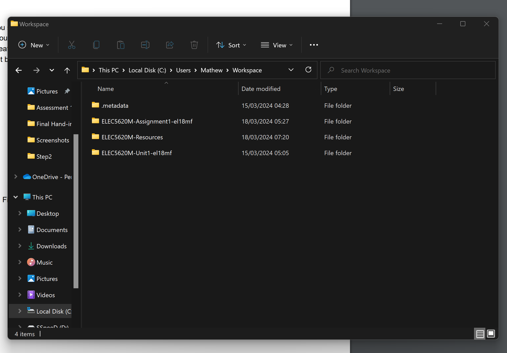
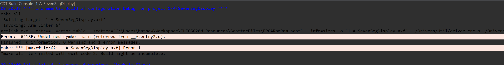

# $${\color{Turquoise}Seven-Segment \space Display \space Driver \space Assessment}$$

## $${\color{grey}ELEC5620M \space | \space Board \space Number: \space F65 \space | \space Assignment \space 1 \space | \space SID: \space 201289335 \space | \space Mathew \space F}$$

## ${\color{orange}Introduction \space Information}$
For more details, refer to the [Assignment 1 Specification](Info/Spec_1.pdf)

The following files are provided:

| File | Purpose |
| ---  | --- |
| `1-A-SevenSegDisplay/main.c`        | A test program which will allow you to test your solution (**do not modify**). |
| `1-A-SevenSegDisplay/DE1SoC_SevenSeg/DE1SoC_SevenSeg.h` | The header file which defines the interface for the driver (**do not modify**). |
| `1-A-SevenSegDisplay/DE1SoC_SevenSeg/DE1SoC_SevenSeg.c` | The implementation file for the driver. You need to complete this file. |

Please note you will need to create and configure the project in Arm Development Studio.

## ${\color{gold}Commit \space Notation}$

To better organise and track changes throughout the assignment, a fairly simplistic commit comment layout was employed as shown below with an example:

| Commit `Number`: | Topic Affected |  `Stage of Assignment` | `Succinct Description of Changes` |
| ---  | --- | ---  | --- |
| Commit 1 | Format | Initial Set-up of file | Revamp of Authors & Addition of myself |

## ${\color{gold}Assignment \space Steps}$
### ${\color{orange}Assignment \space Step \space Checklist}$
The assignment was comprised of the following 7 steps:

- [X] Step 1 - Create Assignment Reposity Via Minerva Link

- [x] Step 2 - Create the project in Arm Development Studio
    - [x] Project name is ${\color{green}1-A-SevenSegDisplay}$
    - [x] Location should be `C:\Users\Mathew\Workspace\ELEC5620-Assignment1-<GitHubUsername>\1-A-SevenSegDisplay` 

- [X] Step 3 - Configure Project Settings
    - [X] Using Unit 1.1 Notes configure the program settings properly or compiling shan't work

- [X] Step 4 - Setting the Base Peripheral Addresses
    - [X] The two peripheral addresses require setting in ${\color{green}DE1SoC_SevenSeg.c}$
    - [X] Successful Debugging

- [X] Step 5 - `DE1SoC_SevenSeg_SetSingle()` - Hexadecimal Single Display Decoder

- [X] Step 6 - `DE1SoC_SevenSeg_SetDoubleHex()` – Hexadecimal Dual Display Decoder

- [X] Step 7 - `DE1SoC_SevenSeg_SetDoubleDec()` – Decimal Dual Display Decoder

### ${\color{orange}Step \space 1 \space - \space Create \space Assignment \space Reposity \space Via \space Minerva \space Link}$ 
- [X] Creation of Assignment Repositry using the link shown on minerva, as shown by the 2 images below: 

### ${\color{orange}Step \space 2 \space - \space Create \space the \space project \space in \space Arm \space Development \space Studio}$
Create Project with:
- [x] titled: `1-A-SevenSegDisplay`
- [x] Location: `C:\Users\<username>\Workspace\ELEC5620-Assignment1-<GitHubUsername>\1-A-SevenSegDisplay`

To undertake this process, after installing and launching Arm Development Studio, the following steps must be following to properly create the project (with accompanying images):

- Select File -> New -> Project...

- Select C Project from the menu that has appeared

- As required, I change the location of the project to `C:\Users\Mathew\Workspace\ELEC5620-Assignment1-el18mf\1-A-SevenSegDisplay`, and project name to `1-A-SevenSegDisplay`

- Double check that the GitHub Repositories are in the correct location

- On the next menu titled "Select Configurations", make sure that debug is ticked while Release is not

- The final window that appears is the summary, which should contain all the following info if the above was done correctly:

### ${\color{orange}Step \space 3 \space - \space Configure \space Project \space Settings}$
- [X] Use Unit 1.1 Notes to properly configure setting
- [X] Test program compilation to prove successful configuration upon successful completion

Configuration steps with accompanying images shown below

- To begin configuring the Arm Development studio, you right click on the project explorer (Left Side) and select properties 

- One in properties, open the drop-down list titled "C/C++ General" and select Paths and Symbols. Once on this screen, click Link Folder

- This opens a new window, in which first click the box "Link to folder in the file system", after which you can click the browse... button which opens the file explorer. In said file explorer navigate to the ELEC5620-Resources folder and select the Drivers folder within. After this is done, click ok

- Back on the same screen, click the includes button (Highlighted in red)

- Once clicked, it will open a similar but different window, now with a languages and include directories section. This will open the "Add directory path" window

- From this window, you select the "Add to all configurations", "Add to all languages", and the third option "*emoji shown in picture* Is a workspace path" boxes, after which you select workspace... opening up a Folder selection window, in which you highlight the Drivers folder and press okay

- Next is configuring the compiler. To do this, go back to properties window, but this time select "C/C++ Build" and click settings

- Once in settings, make the changes outlined in the table below, in the following sections:
    - Under All Tools Settings -> Target
    - Under Arm C Conpiler for Embedded 6 -> Miscellaneous
    - Under Arm Linker 6 -> Image Layout
        - Scatter file code: `${workspace_loc}\ELEC5620M-Resources\ScatterFiles\FPGARomRam.scat`

- Debug Configurations below: Run -0> Debug Config -> Generic Arm C/C++ Application -> New

- Inside the new file, input the following modifications to fully configure the debug settings

### ${\color{orange}Step \space 4 \space - \space Setting \space the \space Base \space Peripheral \space Addresses}$
- [x] Base Peripheral Addresses Set with accompanying proof of successful compilation

> *To note here, while going through the steps, I got a tad distracted while setting up an excel sheet to display how 0-9 and A-F are shown, and what segments light up, causing me to look up some excel based commands. After this, I was cleaning up some tabs and stumbled across an extra Github page open on main.c, and I noticed that on line 25 that key_ptr had been set. I assume this is the correct format, and truthfully is what I had planned to do, but I thought it best to admit this as citing resources is important.*

Two peripheral addresses cover the six 7-segment displays, with the split being:
- HEX0, HEX1, HEX2, and HEX3 on 1
- HEX4 and Hex5 being on the other. 

The parallal I/O Port Control Registers for the 7-Segment display is shown below:

|Address| 31 | 30 ... 24 | 23 | 22 ... 16 | 15 | 14 ... 8 | 7 | 6 ... 0 | Displays Controlled |
| ---  | --- | --- | --- | --- | --- | --- | --- | --- | --- |
| ${\color{green}0xFF200020}$  | X | HEX36-0 | X | HEX26-0 | X | HEX16-0 | X | HEX06-0 | Displays 0 to 3s |
| ${\color{green}0xFF200030}$ | X | X | X | X | X | HEX56-0 | X | HEX46-0 | Displays 4 & 5 |

To note: The use of ${\color{red}volatile \space unsigned \space char*}$ while declaring the addresses is preferrable, due to ${\color{red}char}$ being an 8-bit type and the 7-segment displays using 8 bits of the address. Eases addressing of each 7-segment display

### ${\color{orange}Step \space 5 \space - \space Hexadecimal \space Single \space Display \space Decoder}$
#### ${\color{lightgreen}DE1SoC_SevenSeg_SetSingle()}$ - *Function Prototype on line 38 of [DE1SoC_SevenSeg.h](1-A-SevenSegDisplay/DE1SoC_SevenSeg/DE1SoC_SevenSeg.h)*

- [X] For values 0-9 and A-F, work out which bits need to be set to illuminate the correct sections of the seven-segment display, so that the number is shown on the display. Refer to Figure 1 for the bit to segment mapping, and Figure 2 to figure out which segments are needed for each symbol. 
    - *For example, if 1 is passed in, bits 1 and 2 are high, or if 0xC is passed in, bits 0, 3, 4, and 5 should be set high.*
- [X] Write the function, where you first translate ${\color{red}unsigned \space int}$ value to the relevant bit-mapping value, and call DE1SoC_SevenSeg_Write() with this value. If a value that is out of range is passed in
    - i.e. greater than 0xF (16 or higher), you should set the display to show a dash (segment 6 only).
- [X] Working Feature Test: Use of button KEY0 to increment through 0-9 and A-F. 
    - This button has been configured in the control program to increment the value of HEX0 every time you press it. 
    -   Press the button enough times to move from 0-9 then A-F. After you pass F, the display should just show a dash. You can press KEY3 to reset the value to 0 

### ${\color{orange}Step \space 6 \space - \space Hexadecimal \space Dual \space Display \space Decoder}$
#### ${\color{lightgreen}DE1SoC_SevenSeg_SetDoubleHex()}$ - *Function Prototype on line 49 of [DE1SoC_SevenSeg.h](1-A-SevenSegDisplay/E1SoC_SevenSeg/DE1SoC_SevenSeg.h)*

- [X] This function should take an input number in the range 0x00 - 0xFF and display it on a pair of displays. Use the display given in ${\color{red}unsigned \space int}$ display for the lower digit and display+1 for the higher digit.
    - [X] Out of range inputs should show a dash on both displays.
    - [X] This function will need to call DE1SoC_SevenSeg_SetSingle() twice.

### ${\color{orange}Step \space 7 \space – \space DE1SoC_SevenSeg_SetDoubleDec() \space – \space Decimal \space Dual \space Display \space Decoder}$
#### ${\color{lightgreen}DE1SoC_SevenSeg_SetDoubleDec()}$ - *Function Prototype on line 60 of [DE1SoC_SevenSeg.h](1-A-SevenSegDisplay/DE1SoC_SevenSeg/DE1SoC_SevenSeg.h)*

- [X] This function should take an input number in the range 0 - 99 and display it on a pair of displays. Use the display given in unsigned int display for the lower digit and display+1 for the higher digit.
    - [X] If a value of 9 is passed in, the next value should be 10, 1 on the first display, 0 on the second, **NOT a value of A**.
    - [X] Out of range inputs should show a dash on both displays.
    - [X] This function will need to call DE1SoC_SevenSeg_SetSingle() twice.

***Provided Hint: Investigation of the C modulo (%) operator would be beneficial***

## ${\color{gold}Resources}$
Here is a list of resources created and used during the process of this Assignment:
- Excel Sheet created to allow visualisation of 7-Segment Display for 0-9 and A-F - [7-Segment Excel - Online](https://leeds365-my.sharepoint.com/:x:/g/personal/el18mf_leeds_ac_uk/Edg4A6v9ZDZDtbDtA-TnmbwB0QYruoaQz7MNOmsCEc4idA?e=MDMCSj) or [7-Segment Excel - Local](info/7-segment%20display%20-%20number%20and%20letter%20cell%20identifier.xlsx)
- For step 4, use of [main.c](1-A-SevenSegDisplay\main.c) in bug fixing as well as confirming that the code was correct and instead the project naming was incorrect
- Resource that taught me how to implement colour text within this readme: [stackoverflow](https://stackoverflow.com/questions/11509830/how-to-add-color-to-githubs-readme-md-file#:~:text=You%20can%20however%20add%20color,or%20%22code%22%20tags%20needed.)
- After realising how big the images appeared as, I looked into resizing images and found out an alternative method to embedded images here: [Github comment chain](https://gist.github.com/uupaa/f77d2bcf4dc7a294d109)

- Github Markdown cheat sheet which helped with the contents page [Github CheatSheet](https://github.com/adam-p/markdown-here/wiki/Markdown-Cheatsheet)

- Used the assessment specification as a resource quite obviously, however I also made use of two tables within the document for Step 3: Configuration. [Specification](Info/Spec_1.pdf)

## Debugging: Arm Development Studio and Real-Life Hardware
### Step 3: Debugging
- [X] Testing
    - Number of Errors: 6
    - Error Code: Armclang: Error
    - Error Source: Pulse VPN used to connect to university intranet, which in turn contains access to the Arm Development Studio verification server, was not connected
    - Error Solution Idea: Connected to Pulse VPN 
    - [X] Solution found

- [X] Successful Compilation

Related Images

- Simple license check failure due to the Pulse Secure VPN used to connect to the Universities Intranet & their license server for Arm Development Studio. After reconnecting, these errors disappeared

### Step 4: Debugging
- [X] Testing
    - Number of Errors: 2
    - Error Code: **L6218E and Exit Code 2**
    - Error Source: unidentified main
    - Error Solution Idea: When reading through main.c, I noticed HPS_Watchdog.h was showing as an error, and after this error I thought to see if the drivers folder I had just added to the Arm Dev Project had the HPS_Watchdog.h. It did, and with such similar names, I assumed it was incorrect naming, and so after backing up the workstation files, I copied the GitHub Repo files (folder had M appended to ELEC5620) into the Arm Dev Project folder (folder had no M appended to ELEC5620)
        - [X] Solution found - The folders were indeed meant to be combined, and I assume this was either a simple mistake or, due to the debugging nature of the Assignment, that it was intentional 

- [X] Successful Compilation

Related Images
- Unsuccessful compilation highlighting 2 errors, with code 

- Successful Compilation after implementation of Error Solution

- Files that caused the error, with the almost identical naming yet the omission of the M for the Arm Development Studio Project caused the folders to not combine. 

- Successful Compilation after implementation of Error Solution 

- Hardware testing of the button, showing as I pressed it that it incremented up until it hit the limit, once leaving the approved range of alphanumerics it displayed the middle segment - indication

### Step 5: Debugging
- [X] Testing
    - Number of Errors: 1
    - Error Source: device_browser.py. Please ensure that the environment variable QUARTUS_ROOTDIR is set to the path to the Altera Quartus tools installation.
    - Error Solution Idea: First time this has happened, I assume from the helpful error log message that something is missing 
    - [X] Solution found: Manually downloaded the missing files from my laptop, which also had the software installed and functioning

- [X] Successful Compilation, Testing & Debugging

Related Images

- Only bug encountered during 

- Successful Debugging after 

- 

### Step 6: Debugging
- [X] Testing
    - Number of Errors: 1
    - Error Source: Error: Failed to load client library jtag_client.dll. Please ensure that the environment variable QUARTUS_ROOTDIR is set to the path to the Altera Quartus tools installation.
    - Error Solution Idea: This has happened several times, as for some reason despite moving it back to the correct directory several times, said file (as well as 2 others that sometimes pop-up interchangably) are moved from the root directory and seemingly get deleted/disappear
    - [X] Solution found: Manually relocated/recovered the file (after the second time, I created a working back-up of the QUARTUS_ROOTDIR for ease of repair)

- [X] Successful Compilation & Debugging

Related Images

- Combined Successful Test of Step 6 & 7 due to time restrictions

### Step 7: Debugging
- [X] Testing
    - Number of Errors: 0
    - Error Source: N/A
    - Error Solution Idea: N/A
    - [X] Solution found

- [X] Successful Compilation

Related Images

- Combined Successful Test of Step 6 & 7 due to time restrictions

